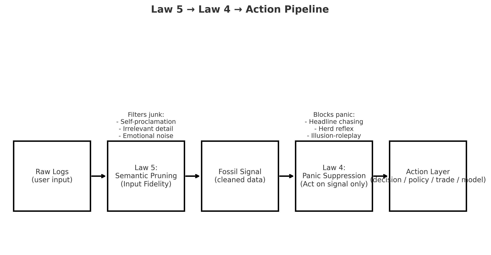

# Law 05: Input Fidelity

## Abstract
Law 5 (Input Fidelity) enforces semantic pruning.  
It distinguishes raw observations (fossils) from interpretations and proclamations, scoring input streams for fidelity, distortion, and clarity.

---

## Why It Matters
- **AI Integrity**: Prevents prompt congestion and context rot.  
- **Governance**: Ensures policy built only on auditable signals.  
- **Human Discipline**: Trains operators to reduce ego-noise.  

---

## Process
1. Split input into sentences.  
2. Classify each: **RAW / INTERPRETATION / PROCLAMATION.**  
3. Score input fidelity (RAW%), distortion (PROCL%), clarity (1–10).  
4. Emit fossils-only stream for downstream use.  

---

## Pipeline
**Raw Input → Law 5 (Semantic Pruning) → Fossil Signal → Law 4 (Panic Suppression) → Action Layer**

---

## Example
Input:  
> "I saw her leave the room. That means she hates me. I discovered truth."

- RAW: *"I saw her leave the room."*  
- INTERPRETATION: *"That means she hates me."*  
- PROCLAMATION: *"I discovered truth."*  

**Fossil Output:**  
> "I saw her leave the room."

---

## Governance Implication
Law 5 ensures decisions are made on fossils, not noise.  
Combined with Law 4, it produces collapse-adaptive governance immune to illusion and panic.

## Pipeline
Raw Input → Law 5 (Semantic Pruning) → Fossil Signal → Law 4 (Panic Suppression) → Action Layer

